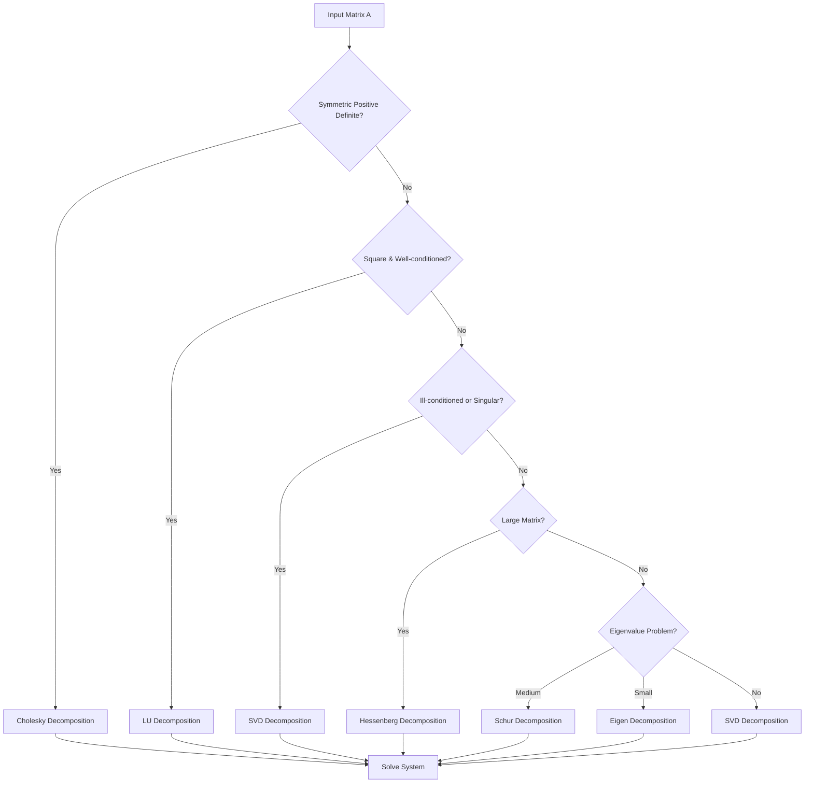
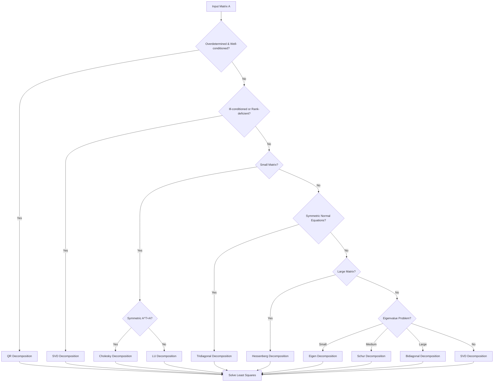
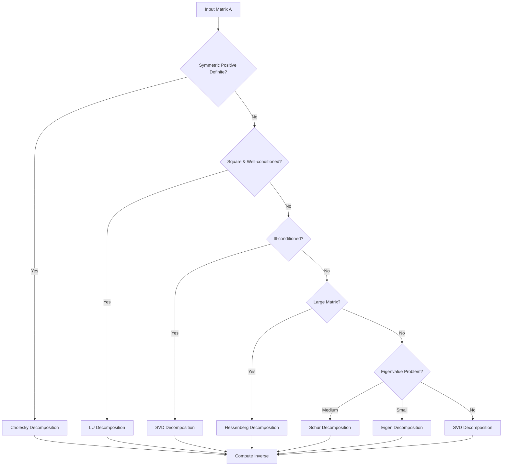
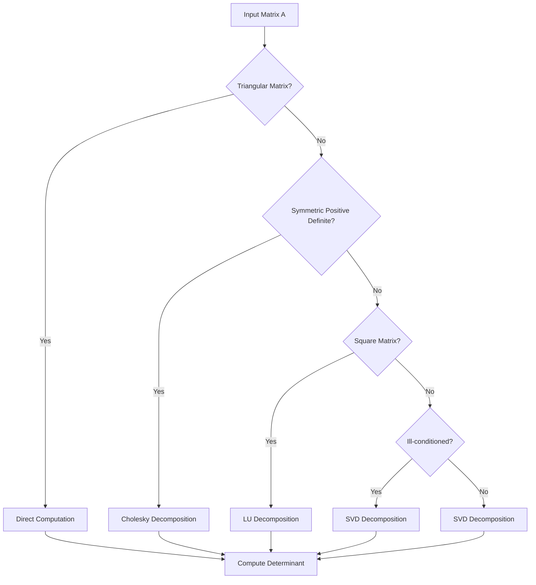
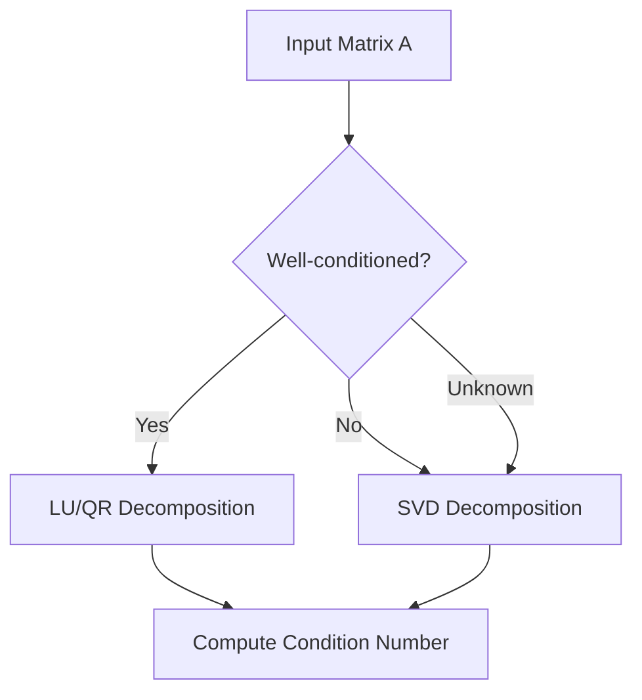

# Matrix Function Solvers / 矩阵函数求解器

This package contains unified solvers for various matrix operations that automatically select the most appropriate decomposition method based on matrix properties.
该软件包包含用于各种矩阵操作的统一求解器，能够根据矩阵属性自动选择最合适的分解方法。

## Implemented Solvers / 实现的求解器

1. **LinearSystemSolver** - Solves linear systems A × X = B
   **线性系统求解器** - 求解线性系统 A × X = B
2. **LeastSquaresSolver** - Solves least squares problems min||A × X - B||₂
   **最小二乘求解器** - 求解最小二乘问题 min||A × X - B||₂
3. **MatrixInversionSolver** - Computes matrix inverse A^(-1)
   **矩阵求逆求解器** - 计算矩阵逆 A^(-1)
4. **DeterminantSolver** - Computes matrix determinant det(A)
   **行列式求解器** - 计算矩阵行列式 det(A)
5. **ConditionNumberSolver** - Computes matrix condition number κ(A)
   **条件数求解器** - 计算矩阵条件数 κ(A)
6. **RankSolver** - Computes matrix rank rank(A)
   **秩求解器** - 计算矩阵秩 rank(A)

## Design Principles / 设计原则

All solvers follow these design principles:
所有求解器遵循以下设计原则：

- **Automatic Selection**: Automatically choose the most appropriate decomposition method based on matrix properties
  **自动选择**：根据矩阵属性自动选择最合适的方法
- **Fallback Mechanism**: Use robust methods (like SVD) when preferred methods fail
  **回退机制**：当首选方法失败时使用稳健方法（如 SVD）
- **Performance Optimization**: Select the fastest applicable method for the given matrix
  **性能优化**：为给定矩阵选择最快适用的方法
- **Numerical Stability**: Prioritize numerically stable methods for ill-conditioned matrices
  **数值稳定性**：优先考虑病态矩阵的数值稳定方法
- **Unified Interface**: Provide consistent APIs regardless of underlying decomposition method
  **统一接口**：提供一致的 API，无论底层分解方法如何

## Detailed Solver Implementations

### 1. LinearSystemSolver / 线性系统求解器

Solves linear systems of equations A × X = B where A is the coefficient matrix and B is the right-hand side.
求解线性方程组 A × X = B，其中 A 是系数矩阵，B 是右侧向量。

#### Scheduling Logic / 调度逻辑
The solver follows this decision tree:
求解器遵循以下决策树：
1. Check if matrix A is symmetric positive definite → Use Cholesky decomposition
   检查矩阵 A 是否为对称正定矩阵 → 使用 Cholesky 分解
2. Check if matrix A is well-conditioned square matrix → Use LU decomposition
   检查矩阵 A 是否为良态方阵 → 使用 LU 分解
3. For ill-conditioned or singular matrices → Use SVD decomposition
   对于病态或奇异矩阵 → 使用 SVD 分解
4. For large matrices → Use Hessenberg decomposition
   对于大型矩阵 → 使用 Hessenberg 分解
5. For eigenvalue-related problems → Use Schur or Eigen decomposition
   对于特征值相关问题 → 使用 Schur 或特征值分解
6. Fallback to SVD for any remaining cases
   对于其余情况回退到 SVD

#### Dependencies and Conditions / 依赖条件
- Cholesky: Requires symmetric positive definite matrix
  Cholesky：需要对称正定矩阵
- LU: Requires square matrix
  LU：需要方阵
- SVD: Works for any matrix (most robust)
  SVD：适用于任何矩阵（最稳健）
- Hessenberg: For large square matrices (performance optimization)
  Hessenberg：用于大型方阵（性能优化）
- Schur/Eigen: For eigenvalue-related problems
  Schur/特征值：用于特征值相关问题

#### Scheduling Flow / 调度流程


### 2. LeastSquaresSolver / 最小二乘求解器

Solves least squares problems min||A × X - B||₂ for overdetermined or inconsistent systems.
求解超定或不一致系统的最小二乘问题 min||A × X - B||₂。

#### Scheduling Logic / 调度逻辑
The solver follows this decision tree:
求解器遵循以下决策树：
1. Check if system is well-conditioned overdetermined → Use QR decomposition
   检查系统是否为良态超定系统 → 使用 QR 分解
2. Check if system is ill-conditioned or rank-deficient → Use SVD decomposition
   检查系统是否为病态或秩亏 → 使用 SVD 分解
3. For normal equations approach (small matrices) → Use Cholesky or LU decomposition
   对于法方程方法（小矩阵） → 使用 Cholesky 或 LU 分解
4. For symmetric normal equations → Use Tridiagonal decomposition
   对于对称法方程 → 使用三对角分解
5. For large matrices → Use Hessenberg decomposition
   对于大型矩阵 → 使用 Hessenberg 分解
6. For eigenvalue-related problems → Use Eigen or Schur decomposition
   对于特征值相关问题 → 使用特征值或 Schur 分解
7. For bidiagonal form problems → Use Bidiagonal decomposition
   对于双对角形式问题 → 使用双对角分解
8. Fallback to SVD for any remaining cases
   对于其余情况回退到 SVD

#### Dependencies and Conditions / 依赖条件
- QR: Well-conditioned overdetermined systems
  QR：良态超定系统
- SVD: Ill-conditioned or rank-deficient systems (most robust)
  SVD：病态或秩亏系统（最稳健）
- Cholesky/LU: For normal equations A^T × A when well-conditioned
  Cholesky/LU：当良态时用于法方程 A^T × A
- Tridiagonal: Symmetric normal equations
  三对角：对称法方程
- Hessenberg: Large normal equations
  Hessenberg：大型法方程
- Eigen/Schur: Eigenvalue-related problems
  特征值/Schur：特征值相关问题
- Bidiagonal: Large matrices and SVD computation
  双对角：大型矩阵和 SVD 计算

#### Scheduling Flow / 调度流程


### 3. MatrixInversionSolver / 矩阵求逆求解器

Computes the inverse of a matrix A^(-1).
计算矩阵的逆 A^(-1)。

#### Scheduling Logic / 调度逻辑
The solver follows this decision tree:
求解器遵循以下决策树：
1. Check if matrix is symmetric positive definite → Use Cholesky decomposition
   检查矩阵是否为对称正定矩阵 → 使用 Cholesky 分解
2. Check if matrix is well-conditioned square matrix → Use LU decomposition
   检查矩阵是否为良态方阵 → 使用 LU 分解
3. For ill-conditioned matrices → Use SVD decomposition
   对于病态矩阵 → 使用 SVD 分解
4. For large matrices → Use Hessenberg decomposition
   对于大型矩阵 → 使用 Hessenberg 分解
5. For eigenvalue-related problems → Use Schur or Eigen decomposition
   对于特征值相关问题 → 使用 Schur 或特征值分解
6. Fallback to SVD for any remaining cases
   对于其余情况回退到 SVD

#### Dependencies and Conditions / 依赖条件
- Cholesky: Symmetric positive definite matrices
  Cholesky：对称正定矩阵
- LU: General square matrices
  LU：一般方阵
- SVD: Any matrix (pseudoinverse for non-square)
  SVD：任何矩阵（非方阵的伪逆）
- Hessenberg: Large square matrices
  Hessenberg：大型方阵
- Schur/Eigen: Eigenvalue-related problems
  Schur/特征值：特征值相关问题

#### Scheduling Flow / 调度流程


### 4. DeterminantSolver / 行列式求解器

Computes the determinant of a square matrix det(A).
计算方阵的行列式 det(A)。

#### Scheduling Logic / 调度逻辑
The solver follows this decision tree:
求解器遵循以下决策树：
1. Check if matrix is triangular → Direct computation
   检查矩阵是否为三角矩阵 → 直接计算
2. Check if matrix is symmetric positive definite → Use Cholesky decomposition
   检查矩阵是否为对称正定矩阵 → 使用 Cholesky 分解
3. For general square matrices → Use LU decomposition
   对于一般方阵 → 使用 LU 分解
4. For ill-conditioned matrices → Use SVD decomposition
   对于病态矩阵 → 使用 SVD 分解
5. Fallback to SVD for any remaining cases
   对于其余情况回退到 SVD

#### Dependencies and Conditions / 依赖条件
- Direct: Triangular matrices
  直接：三角矩阵
- Cholesky: Symmetric positive definite matrices
  Cholesky：对称正定矩阵
- LU: General square matrices
  LU：一般方阵
- SVD: Any matrix (works with singular matrices)
  SVD：任何矩阵（适用于奇异矩阵）

#### Scheduling Flow / 调度流程


### 5. ConditionNumberSolver / 条件数求解器

Computes the condition number of a matrix κ(A).
计算矩阵的条件数 κ(A)。

#### Scheduling Logic / 调度逻辑
The solver follows this decision tree:
求解器遵循以下决策树：
1. For well-conditioned matrices → Use LU or QR decomposition
   对于良态矩阵 → 使用 LU 或 QR 分解
2. For ill-conditioned matrices → Use SVD decomposition
   对于病态矩阵 → 使用 SVD 分解
3. Fallback to SVD for any remaining cases
   对于其余情况回退到 SVD

#### Dependencies and Conditions / 依赖条件
- LU/QR: Well-conditioned matrices
  LU/QR：良态矩阵
- SVD: Any matrix (most accurate for condition number)
  SVD：任何矩阵（条件数最准确）

#### Scheduling Flow / 调度流程


### 6. RankSolver / 秩求解器

Computes the rank of a matrix rank(A).
计算矩阵的秩 rank(A)。

#### Scheduling Logic / 调度逻辑
The solver follows this decision tree:
求解器遵循以下决策树：
1. For well-conditioned matrices → Use LU or QR decomposition
   对于良态矩阵 → 使用 LU 或 QR 分解
2. For rank-deficient or ill-conditioned matrices → Use SVD decomposition
   对于秩亏或病态矩阵 → 使用 SVD 分解
3. Fallback to SVD for any remaining cases
   对于其余情况回退到 SVD

#### Dependencies and Conditions / 依赖条件
- LU/QR: Full-rank matrices
  LU/QR：满秩矩阵
- SVD: Any matrix (most reliable for rank computation)

## Matrix Decomposition Methods / 矩阵分解方法

### 1. Cholesky Decomposition / Cholesky 分解

#### Concept / 概念
Cholesky decomposition factors a symmetric positive definite matrix A as A = L × L^T where L is a lower triangular matrix.
Cholesky 分解将对称正定矩阵 A 分解为 A = L × L^T，其中 L 是下三角矩阵。

#### Characteristics / 特点
- **Requirements**: Matrix must be symmetric and positive definite
  **要求**：矩阵必须是对称且正定的
- **Uniqueness**: Unique decomposition when it exists
  **唯一性**：当分解存在时是唯一的
- **Stability**: Numerically stable
  **稳定性**：数值稳定
- **Efficiency**: Faster than LU decomposition (about half the operations)
  **效率**：比 LU 分解更快（约一半的操作）
- **Applications**: Solving linear systems, Monte Carlo simulations, optimization
  **应用**：求解线性系统、蒙特卡洛模拟、优化

#### Decomposition Structure / 分解结构
- L: Lower triangular matrix
  L：下三角矩阵
- Result: A = L × L^T
  结果：A = L × L^T

#### Why It Works for Solvers / 为何适用于求解器
- Linear systems: Direct forward/backward substitution
  线性系统：直接前向/后向替换
- Determinant: Product of diagonal elements squared
  行列式：对角元素平方的乘积
- Inversion: Invert L and compute (L^(-1))^T × L^(-1)
  求逆：求 L 的逆并计算 (L^(-1))^T × L^(-1)

### 2. LU Decomposition / LU 分解

#### Concept / 概念
LU decomposition factors a square matrix A as A = P × L × U where P is a permutation matrix, L is lower triangular, and U is upper triangular.
LU 分解将方阵 A 分解为 A = P × L × U，其中 P 是置换矩阵，L 是下三角矩阵，U 是上三角矩阵。

#### Characteristics / 特点
- **Requirements**: Square matrix
  **要求**：方阵
- **Variants**: With/without pivoting
  **变体**：带/不带选主元
- **Stability**: Partial pivoting improves numerical stability
  **稳定性**：部分选主元提高数值稳定性
- **Efficiency**: Good for multiple right-hand sides
  **效率**：适用于多个右侧向量
- **Applications**: Solving linear systems, computing determinants, inverting matrices
  **应用**：求解线性系统、计算行列式、矩阵求逆

#### Decomposition Structure / 分解结构
- P: Permutation matrix
  P：置换矩阵
- L: Lower triangular matrix
  L：下三角矩阵
- U: Upper triangular matrix
  U：上三角矩阵
- Result: A = P × L × U
  结果：A = P × L × U

#### Why It Works for Solvers / 为何适用于求解器
- Linear systems: Forward/backward substitution
  线性系统：前向/后向替换
- Determinant: Product of diagonal elements of U (with sign from P)
  行列式：U 的对角元素乘积（带 P 的符号）
- Inversion: Solve A × X = I where I is identity matrix
  求逆：求解 A × X = I，其中 I 是单位矩阵

### 3. QR Decomposition / QR 分解

#### Concept / 概念
QR decomposition factors a matrix A as A = Q × R where Q is an orthogonal matrix and R is upper triangular.
QR 分解将矩阵 A 分解为 A = Q × R，其中 Q 是正交矩阵，R 是上三角矩阵。

#### Characteristics / 特点
- **Requirements**: Any m×n matrix
  **要求**：任何 m×n 矩阵
- **Methods**: Gram-Schmidt, Householder reflections, Givens rotations
  **方法**：Gram-Schmidt、Householder 反射、Givens 旋转
- **Stability**: Numerically stable
  **稳定性**：数值稳定
- **Efficiency**: More expensive than LU but more stable
  **效率**：比 LU 更昂贵但更稳定
- **Applications**: Least squares problems, eigenvalue computation
  **应用**：最小二乘问题、特征值计算

#### Decomposition Structure / 分解结构
- Q: Orthogonal matrix (Q^T × Q = I)
  Q：正交矩阵（Q^T × Q = I）
- R: Upper triangular matrix
  R：上三角矩阵
- Result: A = Q × R
  结果：A = Q × R

#### Why It Works for Solvers / 为何适用于求解器
- Least squares: Transform to R × X = Q^T × B
  最小二乘：转换为 R × X = Q^T × B
- Linear systems: When more stable than LU
  线性系统：当比 LU 更稳定时
- Eigenvalues: Foundation for QR algorithm
  特征值：QR 算法的基础

### 4. SVD Decomposition / SVD 分解

#### Concept / 概念
Singular Value Decomposition factors a matrix A as A = U × Σ × V^T where U and V are orthogonal matrices and Σ is diagonal with non-negative entries.
奇异值分解将矩阵 A 分解为 A = U × Σ × V^T，其中 U 和 V 是正交矩阵，Σ 是对角矩阵且元素非负。

#### Characteristics / 特点
- **Requirements**: Any m×n matrix
  **要求**：任何 m×n 矩阵
- **Uniqueness**: Unique singular values
  **唯一性**：奇异值唯一
- **Stability**: Most numerically stable decomposition
  **稳定性**：最数值稳定的分解
- **Efficiency**: Most computationally expensive
  **效率**：计算最昂贵
- **Applications**: Rank determination, pseudoinverse, data compression
  **应用**：秩确定、伪逆、数据压缩

#### Decomposition Structure / 分解结构
- U: Left singular vectors (orthogonal)
  U：左奇异向量（正交）
- Σ: Singular values (diagonal matrix)
  Σ：奇异值（对角矩阵）
- V: Right singular vectors (orthogonal)
  V：右奇异向量（正交）
- Result: A = U × Σ × V^T
  结果：A = U × Σ × V^T

#### Why It Works for Solvers / 为何适用于求解器
- Least squares: Robust solution even for rank-deficient systems
  最小二乘：即使对于秩亏系统也是稳健解
- Linear systems: Pseudoinverse for singular/non-square matrices
  线性系统：奇异/非方阵的伪逆
- Determinant: Product of singular values
  行列式：奇异值的乘积
- Condition number: Ratio of largest to smallest singular value
  条件数：最大与最小奇异值的比值
- Rank: Count of non-zero singular values
  秩：非零奇异值的计数

### 5. Tridiagonal Decomposition / 三对角分解

#### Concept / 概念
Tridiagonal decomposition reduces a symmetric matrix to tridiagonal form T = Q^T × A × Q where Q is orthogonal and T has non-zero elements only on main diagonal and first super/sub-diagonals.
三对角分解将对称矩阵简化为三对角形式 T = Q^T × A × Q，其中 Q 是正交矩阵，T 仅在主对角线和第一条超/次对角线上有非零元素。

#### Characteristics / 特点
- **Requirements**: Symmetric matrix
  **要求**：对称矩阵
- **Purpose**: First step in eigenvalue algorithms
  **目的**：特征值算法的第一步
- **Stability**: Numerically stable
  **稳定性**：数值稳定
- **Efficiency**: Efficient for symmetric matrices
  **效率**：对对称矩阵高效
- **Applications**: Eigenvalue computation for symmetric matrices
  **应用**：对称矩阵的特征值计算

#### Decomposition Structure / 分解结构
- Q: Orthogonal matrix
  Q：正交矩阵
- T: Tridiagonal matrix
  T：三对角矩阵
- Result: T = Q^T × A × Q
  结果：T = Q^T × A × Q

#### Why It Works for Solvers / 为何适用于求解器
- Eigenvalues: Simplifies eigenvalue computation
  特征值：简化特征值计算
- Linear systems: For symmetric matrices in special cases
  线性系统：在特殊情况下用于对称矩阵

### 6. Hessenberg Decomposition / Hessenberg 分解

#### Concept / 概念
Hessenberg decomposition reduces a square matrix to upper Hessenberg form H = Q^T × A × Q where Q is orthogonal and H has zeros below the first subdiagonal.
Hessenberg 分解将方阵简化为上 Hessenberg 形式 H = Q^T × A × Q，其中 Q 是正交矩阵，H 在第一条次对角线以下为零。

#### Characteristics / 特点
- **Requirements**: Square matrix
  **要求**：方阵
- **Purpose**: First step in eigenvalue algorithms for non-symmetric matrices
  **目的**：非对称矩阵特征值算法的第一步
- **Stability**: Numerically stable
  **稳定性**：数值稳定
- **Efficiency**: More efficient than full reduction
  **效率**：比完全简化更高效
- **Applications**: Eigenvalue computation for general matrices
  **应用**：一般矩阵的特征值计算

#### Decomposition Structure / 分解结构
- Q: Orthogonal matrix
  Q：正交矩阵
- H: Upper Hessenberg matrix
  H：上 Hessenberg 矩阵
- Result: H = Q^T × A × Q
  结果：H = Q^T × A × Q

#### Why It Works for Solvers / 为何适用于求解器
- Eigenvalues: Simplifies eigenvalue computation for general matrices
  特征值：简化一般矩阵的特征值计算
- Linear systems: For large matrices where full reduction is too expensive
  线性系统：对于完全简化太昂贵的大型矩阵

### 7. Schur Decomposition / Schur 分解

#### Concept / 概念
Schur decomposition factors a square matrix A as A = Q × T × Q^T where Q is unitary and T is upper triangular.
Schur 分解将方阵 A 分解为 A = Q × T × Q^T，其中 Q 是酉矩阵，T 是上三角矩阵。

#### Characteristics / 特点
- **Requirements**: Square matrix
  **要求**：方阵
- **Complexity**: May require complex numbers
  **复杂性**：可能需要复数
- **Stability**: Numerically stable
  **稳定性**：数值稳定
- **Applications**: Eigenvalue problems, matrix functions
  **应用**：特征值问题、矩阵函数

#### Decomposition Structure / 分解结构
- Q: Unitary matrix
  Q：酉矩阵
- T: Upper triangular matrix
  T：上三角矩阵
- Result: A = Q × T × Q^T
  结果：A = Q × T × Q^T

#### Why It Works for Solvers / 为何适用于求解器
- Eigenvalues: Directly available on diagonal of T
  特征值：在 T 的对角线上直接可用
- Matrix functions: f(A) = Q × f(T) × Q^T
  矩阵函数：f(A) = Q × f(T) × Q^T

### 8. Eigen Decomposition / 特征值分解

#### Concept / 概念
Eigen decomposition factors a square matrix A as A = V × Λ × V^(-1) where V contains eigenvectors and Λ is diagonal with eigenvalues.
特征值分解将方阵 A 分解为 A = V × Λ × V^(-1)，其中 V 包含特征向量，Λ 是对角矩阵且元素为特征值。

#### Characteristics / 特点
- **Requirements**: Diagonalizable matrix
  **要求**：可对角化矩阵
- **Uniqueness**: Unique when eigenvalues are distinct
  **唯一性**：当特征值不重复时唯一
- **Stability**: Can be ill-conditioned for repeated eigenvalues
  **稳定性**：对于重复特征值可能病态
- **Applications**: Solving systems of differential equations, principal component analysis
  **应用**：求解微分方程组、主成分分析

#### Decomposition Structure / 分解结构
- V: Matrix of eigenvectors
  V：特征向量矩阵
- Λ: Diagonal matrix of eigenvalues
  Λ：特征值对角矩阵
- Result: A = V × Λ × V^(-1)
  结果：A = V × Λ × V^(-1)

#### Why It Works for Solvers / 为何适用于求解器
- Linear systems: When matrix can be diagonalized
  线性系统：当矩阵可对角化时
- Matrix powers: A^n = V × Λ^n × V^(-1)
  矩阵幂：A^n = V × Λ^n × V^(-1)

### 9. Bidiagonal Decomposition / 双对角分解

#### Concept / 概念
Bidiagonal decomposition factors a matrix A as A = U × B × V^T where U and V are orthogonal and B is bidiagonal.
双对角分解将矩阵 A 分解为 A = U × B × V^T，其中 U 和 V 是正交矩阵，B 是双对角矩阵。

#### Characteristics / 特点
- **Requirements**: Any m×n matrix
  **要求**：任何 m×n 矩阵
- **Purpose**: First step in SVD computation
  **目的**：SVD 计算的第一步
- **Stability**: Numerically stable
  **稳定性**：数值稳定
- **Applications**: SVD computation, rank-revealing decompositions
  **应用**：SVD 计算、秩揭示分解

#### Decomposition Structure / 分解结构
- U: Left orthogonal matrix
  U：左正交矩阵
- B: Bidiagonal matrix
  B：双对角矩阵
- V: Right orthogonal matrix
  V：右正交矩阵
- Result: A = U × B × V^T
  结果：A = U × B × V^T

#### Why It Works for Solvers / 为何适用于求解器
- SVD: First step in SVD computation
  SVD：SVD 计算的第一步
- Rank: Can reveal numerical rank
  秩：可以揭示数值秩

## Usage Examples

```
// Solve a linear system
IMatrix<Double> A = Linalg.matrix(new double[][]{{2, 1}, {1, 2}});
IMatrix<Double> B = Linalg.matrix(new double[][]{{1, 0}, {0, 1}});
IMatrix<Double> X = LinearSystemSolver.solve(A, B);

// Compute matrix inverse
IMatrix<Double> AInv = MatrixInversionSolver.invert(A);

// Compute determinant
double det = DeterminantSolver.compute(A);

// Compute condition number
double cond = ConditionNumberSolver.compute(A);

// Compute rank
int rank = RankSolver.compute(A);

// Solve least squares problem
IMatrix<Double> LS = LeastSquaresSolver.solve(A, B);

// Solve least squares problem and get both solution and residual
Tuple2<IMatrix<Double>, Double> result = LeastSquaresSolver.solveWithResidual(A, B);
IMatrix<Double> solution = result.getFirst();
Double residualNorm = result.getSecond();
```

