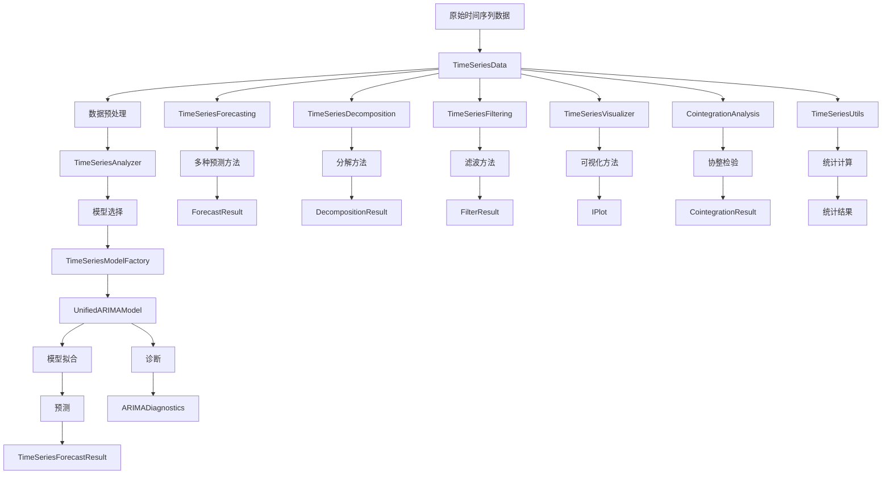
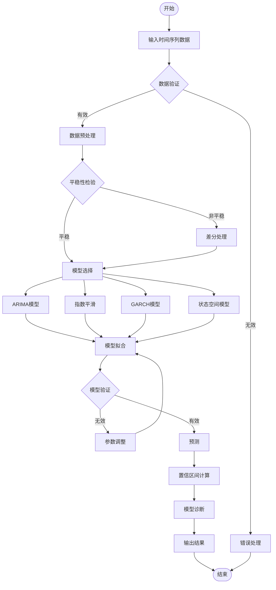
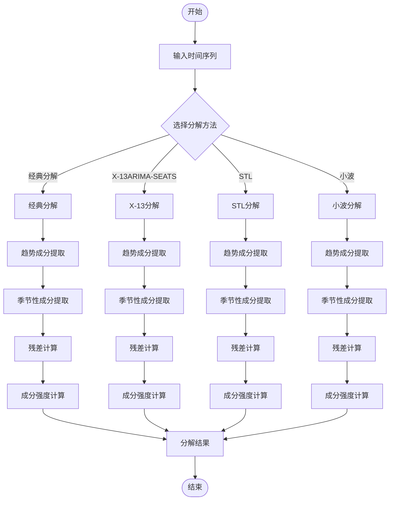
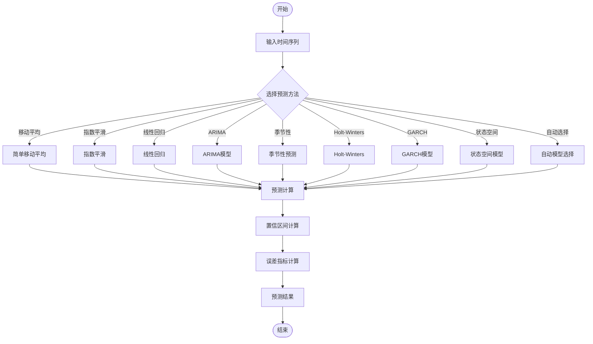
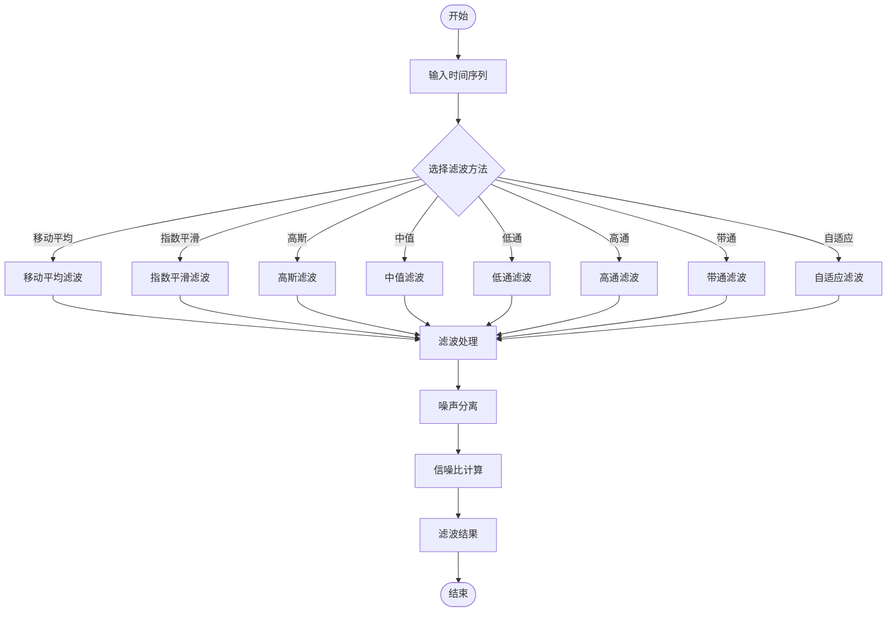

# 时间序列包类关系图

## 类层次结构图

```mermaid
classDiagram
    %% 核心接口
    class ITimeSeriesModel {
        <<interface>>
        +getModelType() ModelType
        +getModelState() ModelState
        +getModelName() String
        +forecastOneStep() double
        +forecast(int steps) IVector~Double~
        +forecastWithConfidence(int steps, double confidenceLevel) ITimeSeriesForecastResult
        +diagnose() ITimeSeriesDiagnostics
        +getResiduals() IVector~Double~
        +getFittedValues() IVector~Double~
        +isValid() boolean
        +getSummary() String
        +reset() void
        +clone() ITimeSeriesModel
    }

    class ITimeSeriesForecastResult {
        <<interface>>
        +getForecastVector() IVector~Double~
        +getLowerBoundsVector() IVector~Double~
        +getUpperBoundsVector() IVector~Double~
        +getForecastSteps() int
        +getConfidenceLevel() double
        +getErrorMetrics() double[]
        +getSummary() String
    }

    class ITimeSeriesDiagnostics {
        <<interface>>
        +performNormalityTest() TestResult
        +performAutocorrelationTest() TestResult
        +performHeteroscedasticityTest() TestResult
        +getResidualAnalysis() Map~String, Object~
        +getSummary() String
    }

    %% 核心数据类
    class TimeSeriesData {
        -timestamps: List~LocalDateTime~
        -data: IMatrix~Double~
        -columnNames: String[]
        -samplingRate: double
        +getTimestamps() List~LocalDateTime~
        +getData() IMatrix~Double~
        +getVariable(int index) IVector~Double~
        +getVariable(String name) IVector~Double~
        +slice(int start, int end) TimeSeriesData
        +resample(double newRate) TimeSeriesData
        +addNoise(double level) TimeSeriesData
        +getStatistics() IMatrix~Double~
    }

    %% 模型实现类
    class UnifiedARIMAModel {
        -p: int
        -d: int
        -q: int
        -arCoeffs: IVector~Double~
        -maCoeffs: IVector~Double~
        -sigma2: double
        -aic: double
        -bic: double
        -logLikelihood: double
        +fit(IVector~Double~ data, int p, int d, int q) UnifiedARIMAModel
        +getP() int
        +getD() int
        +getQ() int
        +getArCoeffs() IVector~Double~
        +getMaCoeffs() IVector~Double~
    }

    class TimeSeriesForecastResult {
        -forecast: IVector~Double~
        -lowerBounds: IVector~Double~
        -upperBounds: IVector~Double~
        -forecastSteps: int
        -confidenceLevel: double
        -errorMetrics: double[]
        +getForecastVector() IVector~Double~
        +getLowerBoundsVector() IVector~Double~
        +getUpperBoundsVector() IVector~Double~
        +exportToCSV(String filename) void
        +exportToJSON(String filename) void
    }

    class ARIMADiagnostics {
        -residuals: IVector~Double~
        -originalData: IVector~Double~
        -fittedValues: IVector~Double~
        -arCoeffs: IVector~Double~
        -maCoeffs: IVector~Double~
        -sigma2: double
        +performNormalityTest() TestResult
        +performAutocorrelationTest() TestResult
        +performHeteroscedasticityTest() TestResult
        +getResidualAnalysis() Map~String, Object~
    }

    %% 工厂类
    class TimeSeriesModelFactory {
        <<utility>>
        +createARIMAModel(IVector~Double~ data, int p, int d, int q) ITimeSeriesModel
        +createARIMAModel(IVector~Double~ data, int maxP, int maxD, int maxQ, SelectionCriterion criterion) ITimeSeriesModel
        +createModel(IVector~Double~ data, ModelConfig config) ITimeSeriesModel
        +selectBestModel(IVector~Double~ data, ModelType[] types, SelectionCriterion criterion) ITimeSeriesModel
        +getSupportedModelTypes() ModelType[]
        +registerModelType(ModelType type, Class~ITimeSeriesModel~ clazz) void
    }

    %% 分析工具类
    class TimeSeriesAnalyzer {
        -data: IVector~Double~
        -name: String
        -timestamps: LocalDateTime[]
        -currentModel: ITimeSeriesModel
        -lastForecast: ITimeSeriesForecastResult
        -lastDiagnostics: ITimeSeriesDiagnostics
        +analyze(AnalysisConfig config) AnalysisResult
        +quickAnalyze() AnalysisResult
        +forecast(int steps, double confidenceLevel) ITimeSeriesForecastResult
        +diagnose() ITimeSeriesDiagnostics
        +getDataStatistics() Map~String, Object~
        +getTrendAnalysis() Map~String, Object~
        +getSeasonalAnalysis(int period) Map~String, Object~
    }

    %% 功能类
    class TimeSeriesUtils {
        <<utility>>
        +calculateSkewness(IVector~Double~ data) double
        +calculateKurtosis(IVector~Double~ data) double
        +calculateAutocorrelation(IVector~Double~ data, int maxLag) IVector~Double~
        +calculatePartialAutocorrelation(IVector~Double~ data, int maxLag) IVector~Double~
        +analyzeTrend(IVector~Double~ data) TrendResult
        +detectTrendStrength(IVector~Double~ data) double
        +calculateSeasonalComponent(IVector~Double~ data, int period) IVector~Double~
        +detectSeasonalStrength(IVector~Double~ data, int period) double
        +movingAverageForecast(IVector~Double~ data, int steps, int windowSize) IVector~Double~
        +exponentialSmoothingForecast(IVector~Double~ data, int steps, double alpha) IVector~Double~
        +difference(IVector~Double~ data, int order) IVector~Double~
        +checkStationarity(IVector~Double~ data) boolean
        +standardize(IVector~Double~ data) IVector~Double~
        +normalize(IVector~Double~ data) IVector~Double~
        +calculateFeatures(IVector~Double~ data) IVector~Double~
    }

    class TimeSeriesForecasting {
        <<utility>>
        +simpleMovingAverage(TimeSeriesData data, int variableIndex, int windowSize, int steps, double confidence) ForecastResult
        +exponentialSmoothing(TimeSeriesData data, int variableIndex, double alpha, int steps, double confidence) ForecastResult
        +linearRegression(TimeSeriesData data, int variableIndex, int steps, double confidence) ForecastResult
        +arimaForecast(TimeSeriesData data, int variableIndex, int p, int d, int q, int steps, double confidence) ForecastResult
        +seasonalForecast(TimeSeriesData data, int variableIndex, int period, int steps, double confidence) ForecastResult
        +holtWintersForecast(TimeSeriesData data, int variableIndex, double alpha, double beta, double gamma, int period, int steps, double confidence) ForecastResult
        +garchForecast(TimeSeriesData data, int variableIndex, int p, int q, int steps, double confidence) ForecastResult
        +stateSpaceForecast(TimeSeriesData data, int variableIndex, double sigmaEta, double sigmaZeta, double sigmaEpsilon, int steps, double confidence) ForecastResult
        +autoForecast(TimeSeriesData data, int variableIndex, int steps, double confidence) ForecastResult
    }

    class TimeSeriesDecomposition {
        <<utility>>
        +classicalDecomposition(TimeSeriesData data, int variableIndex, int period, DecompositionModel model) DecompositionResult
        +x13Decomposition(TimeSeriesData data, int variableIndex, int period) DecompositionResult
        +stlDecomposition(TimeSeriesData data, int variableIndex, int period, int seasonalWindow, int trendWindow) DecompositionResult
        +waveletDecomposition(TimeSeriesData data, int variableIndex, String wavelet, int levels) DecompositionResult
    }

    class TimeSeriesFiltering {
        <<utility>>
        +movingAverage(TimeSeriesData data, int variableIndex, int windowSize) FilterResult
        +exponentialSmoothing(TimeSeriesData data, int variableIndex, double alpha) FilterResult
        +gaussianFilter(TimeSeriesData data, int variableIndex, double sigma) FilterResult
        +medianFilter(TimeSeriesData data, int variableIndex, int windowSize) FilterResult
        +lowPassFilter(TimeSeriesData data, int variableIndex, double cutoffFreq, int order) FilterResult
        +highPassFilter(TimeSeriesData data, int variableIndex, double cutoffFreq, int order) FilterResult
        +bandPassFilter(TimeSeriesData data, int variableIndex, double lowFreq, double highFreq, int order) FilterResult
        +adaptiveFilter(TimeSeriesData data, int variableIndex, double learningRate) FilterResult
    }

    class TimeSeriesVisualizer {
        <<utility>>
        +plotTimeSeries(TimeSeriesData data, String title) IPlot
        +plotTrendAnalysis(TimeSeriesData data, String title) IPlot
        +plotSeasonalDecomposition(TimeSeriesData data, int period, String title) IPlot
        +plotAutocorrelation(TimeSeriesData data, int maxLag, String title) IPlot
        +plotPartialAutocorrelation(TimeSeriesData data, int maxLag, String title) IPlot
        +plotForecasting(TimeSeriesData data, int steps, String title) IPlot
        +plotTimeSeriesStatistics(TimeSeriesData data, String title) IPlot
        +plotMultivariateTimeSeries(TimeSeriesData data, String title) IPlot
        +plotTimeSeriesFeatures(TimeSeriesData data, String title) IPlot
        +createTimeSeriesDashboard(TimeSeriesData data, String title) List~IPlot~
    }

    class CointegrationAnalysis {
        <<utility>>
        +engleGrangerTest(IVector~Double~ y, IVector~Double~ x, int maxLags) EngleGrangerResult
        +johansenTest(IMatrix~Double~ data, int maxLags, TrendType trendType) JohansenResult
        +estimateCointegratingRelationship(IVector~Double~ y, IVector~Double~ x) CointegratingRelationship
        +estimateECM(IVector~Double~ deltaY, IVector~Double~ deltaX, IVector~Double~ ect, int lags) ErrorCorrectionModel
    }

    %% 关系定义
    ITimeSeriesModel <|.. UnifiedARIMAModel : implements
    ITimeSeriesForecastResult <|.. TimeSeriesForecastResult : implements
    ITimeSeriesDiagnostics <|.. ARIMADiagnostics : implements

    TimeSeriesData --> IMatrix~Double~ : contains
    TimeSeriesData --> IVector~Double~ : contains

    TimeSeriesAnalyzer --> ITimeSeriesModel : uses
    TimeSeriesAnalyzer --> ITimeSeriesForecastResult : uses
    TimeSeriesAnalyzer --> ITimeSeriesDiagnostics : uses
    TimeSeriesAnalyzer --> TimeSeriesModelFactory : uses

    TimeSeriesModelFactory --> ITimeSeriesModel : creates
    TimeSeriesModelFactory --> UnifiedARIMAModel : creates

    TimeSeriesForecasting --> TimeSeriesData : uses
    TimeSeriesForecasting --> UnifiedARIMAModel : uses

    TimeSeriesDecomposition --> TimeSeriesData : uses
    TimeSeriesFiltering --> TimeSeriesData : uses
    TimeSeriesVisualizer --> TimeSeriesData : uses
    CointegrationAnalysis --> IVector~Double~ : uses
    CointegrationAnalysis --> IMatrix~Double~ : uses

    TimeSeriesUtils --> IVector~Double~ : uses
    TimeSeriesUtils --> IMatrix~Double~ : uses

    UnifiedARIMAModel --> TimeSeriesForecastResult : creates
    UnifiedARIMAModel --> ARIMADiagnostics : creates
```

## 包结构图

```mermaid
graph TB
    subgraph "com.reremouse.lab.math.timeseries"
        subgraph "model包"
            ITimeSeriesModel["ITimeSeriesModel<br/>统一模型接口"]
            ITimeSeriesForecastResult["ITimeSeriesForecastResult<br/>预测结果接口"]
            ITimeSeriesDiagnostics["ITimeSeriesDiagnostics<br/>诊断接口"]
            UnifiedARIMAModel["UnifiedARIMAModel<br/>ARIMA模型实现"]
            TimeSeriesForecastResult["TimeSeriesForecastResult<br/>预测结果实现"]
            ARIMADiagnostics["ARIMADiagnostics<br/>ARIMA诊断实现"]
            TimeSeriesModelFactory["TimeSeriesModelFactory<br/>模型工厂"]
            ExponentialSmoothingModels["ExponentialSmoothingModels<br/>指数平滑模型"]
            GARCHModel["GARCHModel<br/>GARCH模型"]
            StateSpaceModel["StateSpaceModel<br/>状态空间模型"]
            VARModel["VARModel<br/>VAR模型"]
        end

        subgraph "核心类"
            TimeSeriesData["TimeSeriesData<br/>时间序列数据容器"]
            TimeSeriesAnalyzer["TimeSeriesAnalyzer<br/>统一分析器"]
        end

        subgraph "功能类"
            TimeSeriesUtils["TimeSeriesUtils<br/>工具类"]
            TimeSeriesForecasting["TimeSeriesForecasting<br/>预测类"]
            TimeSeriesDecomposition["TimeSeriesDecomposition<br/>分解类"]
            TimeSeriesFiltering["TimeSeriesFiltering<br/>滤波类"]
            TimeSeriesVisualizer["TimeSeriesVisualizer<br/>可视化类"]
            CointegrationAnalysis["CointegrationAnalysis<br/>协整分析类"]
        end
    end

    subgraph "依赖包"
        linalg["linalg包<br/>线性代数"]
        viz["viz包<br/>可视化"]
        signal["signal包<br/>信号处理"]
        stats["stats包<br/>统计"]
    end

    %% 依赖关系
    TimeSeriesData --> linalg
    TimeSeriesAnalyzer --> linalg
    TimeSeriesUtils --> linalg
    TimeSeriesForecasting --> linalg
    TimeSeriesDecomposition --> linalg
    TimeSeriesDecomposition --> signal
    TimeSeriesFiltering --> signal
    TimeSeriesVisualizer --> viz
    CointegrationAnalysis --> linalg
    CointegrationAnalysis --> stats

    %% 内部关系
    TimeSeriesAnalyzer --> TimeSeriesData
    TimeSeriesAnalyzer --> TimeSeriesModelFactory
    TimeSeriesForecasting --> TimeSeriesData
    TimeSeriesDecomposition --> TimeSeriesData
    TimeSeriesFiltering --> TimeSeriesData
    TimeSeriesVisualizer --> TimeSeriesData
    TimeSeriesVisualizer --> TimeSeriesDecomposition
    TimeSeriesVisualizer --> TimeSeriesUtils
```

## 数据流图

```mermaid
flowchart TD
    A[原始时间序列数据] --> B[TimeSeriesData]
    B --> C[数据预处理]
    C --> D[TimeSeriesAnalyzer]
    
    D --> E[模型选择]
    E --> F[TimeSeriesModelFactory]
    F --> G[UnifiedARIMAModel]
    
    G --> H[模型拟合]
    H --> I[预测]
    I --> J[TimeSeriesForecastResult]
    
    G --> K[诊断]
    K --> L[ARIMADiagnostics]
    
    B --> M[TimeSeriesForecasting]
    M --> N[多种预测方法]
    N --> O[ForecastResult]
    
    B --> P[TimeSeriesDecomposition]
    P --> Q[分解方法]
    Q --> R[DecompositionResult]
    
    B --> S[TimeSeriesFiltering]
    S --> T[滤波方法]
    T --> U[FilterResult]
    
    B --> V[TimeSeriesVisualizer]
    V --> W[可视化方法]
    W --> X[IPlot]
    
    B --> Y[CointegrationAnalysis]
    Y --> Z[协整检验]
    Z --> AA[CointegrationResult]
    
    B --> BB[TimeSeriesUtils]
    BB --> CC[统计计算]
    CC --> DD[统计结果]
```

## 时序处理流程图

```mermaid
flowchart TD
    Start([开始]) --> Input[输入时间序列数据]
    Input --> Validate{数据验证}
    Validate -->|无效| Error[错误处理]
    Validate -->|有效| Preprocess[数据预处理]
    
    Preprocess --> Stationarity{平稳性检验}
    Stationarity -->|非平稳| Diff[差分处理]
    Stationarity -->|平稳| ModelSelect[模型选择]
    Diff --> ModelSelect
    
    ModelSelect --> ARIMA[ARIMA模型]
    ModelSelect --> ES[指数平滑]
    ModelSelect --> GARCH[GARCH模型]
    ModelSelect --> SS[状态空间模型]
    
    ARIMA --> Fit[模型拟合]
    ES --> Fit
    GARCH --> Fit
    SS --> Fit
    
    Fit --> ValidateModel{模型验证}
    ValidateModel -->|无效| Adjust[参数调整]
    ValidateModel -->|有效| Forecast[预测]
    Adjust --> Fit
    
    Forecast --> Confidence[置信区间计算]
    Confidence --> Diagnose[模型诊断]
    Diagnose --> Results[输出结果]
    Results --> End([结束])
    
    Error --> End
```

## 分解流程图

```mermaid
flowchart TD
    Start([开始]) --> Input[输入时间序列]
    Input --> Method{选择分解方法}
    
    Method -->|经典分解| Classical[经典分解]
    Method -->|X-13ARIMA-SEATS| X13[X-13分解]
    Method -->|STL| STL[STL分解]
    Method -->|小波| Wavelet[小波分解]
    
    Classical --> Trend1[趋势成分提取]
    X13 --> Trend2[趋势成分提取]
    STL --> Trend3[趋势成分提取]
    Wavelet --> Trend4[趋势成分提取]
    
    Trend1 --> Seasonal1[季节性成分提取]
    Trend2 --> Seasonal2[季节性成分提取]
    Trend3 --> Seasonal3[季节性成分提取]
    Trend4 --> Seasonal4[季节性成分提取]
    
    Seasonal1 --> Residual1[残差计算]
    Seasonal2 --> Residual2[残差计算]
    Seasonal3 --> Residual3[残差计算]
    Seasonal4 --> Residual4[残差计算]
    
    Residual1 --> Strength1[成分强度计算]
    Residual2 --> Strength2[成分强度计算]
    Residual3 --> Strength3[成分强度计算]
    Residual4 --> Strength4[成分强度计算]
    
    Strength1 --> Result[分解结果]
    Strength2 --> Result
    Strength3 --> Result
    Strength4 --> Result
    
    Result --> End([结束])
```

## 预测流程图

```mermaid
flowchart TD
    Start([开始]) --> Input[输入时间序列]
    Input --> Method{选择预测方法}
    
    Method -->|移动平均| MA[简单移动平均]
    Method -->|指数平滑| ES[指数平滑]
    Method -->|线性回归| LR[线性回归]
    Method -->|ARIMA| ARIMA[ARIMA模型]
    Method -->|季节性| Seasonal[季节性预测]
    Method -->|Holt-Winters| HW[Holt-Winters]
    Method -->|GARCH| GARCH[GARCH模型]
    Method -->|状态空间| SS[状态空间模型]
    Method -->|自动选择| Auto[自动模型选择]
    
    MA --> Forecast[预测计算]
    ES --> Forecast
    LR --> Forecast
    ARIMA --> Forecast
    Seasonal --> Forecast
    HW --> Forecast
    GARCH --> Forecast
    SS --> Forecast
    Auto --> Forecast
    
    Forecast --> Confidence[置信区间计算]
    Confidence --> Error[误差指标计算]
    Error --> Result[预测结果]
    Result --> End([结束])
```

## 滤波流程图

```mermaid
flowchart TD
    Start([开始]) --> Input[输入时间序列]
    Input --> Filter{选择滤波方法}
    
    Filter -->|移动平均| MA[移动平均滤波]
    Filter -->|指数平滑| ES[指数平滑滤波]
    Filter -->|高斯| Gaussian[高斯滤波]
    Filter -->|中值| Median[中值滤波]
    Filter -->|低通| LowPass[低通滤波]
    Filter -->|高通| HighPass[高通滤波]
    Filter -->|带通| BandPass[带通滤波]
    Filter -->|自适应| Adaptive[自适应滤波]
    
    MA --> Process[滤波处理]
    ES --> Process
    Gaussian --> Process
    Median --> Process
    LowPass --> Process
    HighPass --> Process
    BandPass --> Process
    Adaptive --> Process
    
    Process --> Noise[噪声分离]
    Noise --> SNR[信噪比计算]
    SNR --> Result[滤波结果]
    Result --> End([结束])
```
